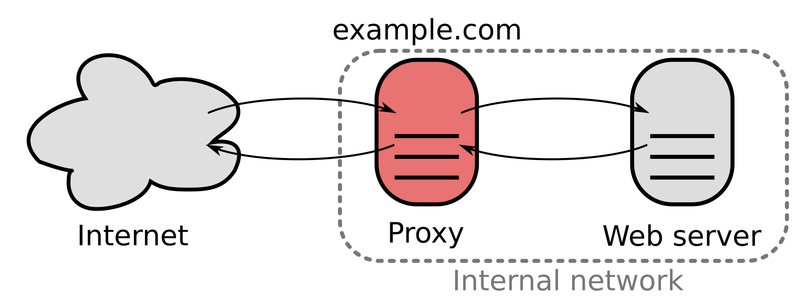

# AWS Guide

## Basics

[basile-rommes.com](http://basile-rommes.com)

https://aws.amazon.com/

Top right: Sign in to the console
Use Google email and Authenticator app to sign in.

After sign in, make sure to select on the top right

Stockholm (EU-North)

which will lead you to:

https://eu-north-1.console.aws.amazon.com/

EC2

This should show you the amount of running instances: e.g. Instances (1)


Select instance and click “connect” on the top right


Important:

```bash
sudo su # change to root

frontend = digital-resume-template-streamlit-Basile on Github (use git pull to update?)
```

Important files:

```bash
~/frontend/Dockerfile
```

\# This is only the (conda?) python environment for the frontend app, all the files that make the app run are alredy in frontend

```bash
~/frontend/digital-resume-template-streamlit-Basile 
```

##  Load balancer:

```bash
vim reverseproxy/nginx.conf
```

nginx is the software used to configure a load balancer for your webserver



## Check if reverseproxy 

```bash
systemctl status
```

Important processes:

​      │ ├─reverseproxy.service

​      │ │ └─630767 sudo docker run -p 80:80 reverseproxy

…

​      │ ├─docker-3050bf8a265c42649bb6cb7f97b4a06f80a1644f502cc0f0eb86653bfb63e36e.scope

​      │ │ ├─630853 "nginx: master process /usr/sbin/nginx -g daemon off;"

​      │ │ └─630876 "nginx: worker process"

​      │ ├─docker-c25dc9a5db54f35f564c5e63afc3c7e5f4e99d03ee9aa94a7309e6e63eeffd54.scope

​      │ │ └─630502 /usr/local/bin/python3.12 /usr/local/bin/streamlit run --server.port=80 --server.address=0.0.0.0 app.py

Or check them individually:

```bash
systemctl status reverseproxy

systemctl status frontend # always shows (code=exited, status=203/EXEC) for some reason
```

## Guide: setting up an additional page on [basile-rommes.com](http://basile-rommes.com), without putting the code into digital-resume/app.py

WARNING: the text below is much more convoluted then necessary although might cover some error cases. Instead, jump to section:
*AWS Host New Webapp* for a concise guide.


Step 1: have digital-resume updated on github, with a link to your project (URL will be basile-rommes/project-name but the project-name can be different (shorter) than the github project name and it MUST BE LOWERCASE)

Step 2: Have your project uploaded on github

```bash
cd basile-rommes
rm -fr digital-resume # no worries, your website will still be up and running in it's docker container during this process
git clone https://github.com/romba050/digital-resume-template-streamlit-Basile.git digital-resume
git clone https://github.com/your-git-account/you-git-url.git project_name
```

$(~/ubuntu/reverseproxy) OR ubuntu@ip-172-31-37-139:~/basile-rommes/nginx$
```bash
cd nginx/
vim default.conf # or: nano default.conf 
```

-> add upstream project_name {…}

-> add location /project_name {…}

```bash
    location /NAME/ {
        rewrite ^/NAME(/.*)$ $1 break;
        proxy_pass http://NAME:8506;
        proxy_set_header Host $host;
        proxy_set_header X-Real-IP $remote_addr;
        proxy_set_header X-Forwarded-For $proxy_add_x_forwarded_for;
        proxy_set_header X-Forwarded-Proto $scheme;

        # WebSocket support for Streamlit
        proxy_http_version 1.1;
        proxy_set_header Upgrade $http_upgrade;
        proxy_set_header Connection "upgrade";
    }
```

Then:

```bash
docker restart nginx # where nginx is the name of my nginx docker, you can check what your naem is with docker ps
```


$(~/ubuntu/reverseproxy) OR ubuntu@ip-172-31-37-139:~/basile-rommes/nginx$

```bash
# docker build -t reverseproxy . --no-cache
docker build -t nginx . --no-cache
time docker build --progress=plain -t project-name ./project-name # this can take a while
```

```bash
cd ../basile-rommes
# add to docker-commands.sh
docker run -dit --name project-name --network basile-rommes-network -p 850<i>:850<i> project-name
# then
sh docker-commands.sh  # this took 39s last time
```

# ## now we get to this problem:

How can I rerun a docker image that is already running? 

https://claude.ai/chat/fee95d5f-605d-4bcb-a9bb-b406be1a1ec3


\# stop old running docker processes:

```bash
docker ps
```

root@ip-172-31-37-139:/home/ubuntu/reverseproxy# docker ps

CONTAINER ID  IMAGE     COMMAND         CREATED   STATUS   PORTS                  NAMES

3050bf8a265c  b3880ad7dba6  "/docker-entrypoint.…"  6 days ago  Up 6 days  0.0.0.0:80->80/tcp, :::80->80/tcp    ecstatic_chatelet

c25dc9a5db54  frontend    "streamlit run --ser…"  6 days ago  Up 6 days  0.0.0.0:3000->80/tcp, :::3000->80/tcp  tender_grothendieck


\# stops all running docker processes

```bash
docker stop $(docker ps -q)
```

```bash
docker ps
```

We can see that reverseproxy is immediatly restarted because of daemon

```bash
systemctl status reverseproxy
```

```bash
cd ../NEAR_data_request

vim Dockerfile # add correct port, e.g. 3001

docker build -t project_name . --no-cache
```

\# threw error for me becuase I was out of space

29.27 ERROR: Could not install packages due to an OSError: [Errno 28] No space left on device: '/usr/local/lib/python3.12/site-packages/pandas/core/internals'


\# to clean:

```bash
docker system df

docker system prune -af
```


\# to increase EC2 storage volume:

https://stackoverflow.com/questions/66773832/increase-ec2-disk-storage-without-losing-any-data

-> backup EC2 instance via GUI

-> increase volume via GUI

\# ssh into your instance 

```bash
df -h -> will tell you the volume size
```

```bash
lsblk -> display information about the block devices attached to your instance

sudo growpart /dev/nvme0n1 1 # resize the first partition on the device nvme0n1.

df -h -> to verify the size again (no change should be noticable)
```

\# Use df -T / | awk 'NR==2 {print $2}' to get the file system type. Then use resize2fs for ext4 and xfs_growfs for xfs.

```bash
sudo resize2fs /dev/nvme0n1p1 # extends the filesystem to fill the newly expanded partition space

df -h -> to verify the size again (change should be noticable)
```


\# Finally we can build the docker image as now there should be enough space:

```bash
docker build -t near_data_request . --no-cache # -t gives a nametag, which is referenced in the docker run command! Base of the docker image is the Dockerfile, so make sure you are in the correct folder!
```


\# source: https://medium.com/@sstarr1879/how-to-build-and-deploy-multiple-streamlit-apps-on-aws-ec2-with-nginx-1424fef8737f

Test Everything Locally First! Run the following commands to run the containers you just built and make sure everything launches correctly.

```bash
docker network create streamlit-network
```

```bash
docker run --name frontend --network my-network -p 3000:80 frontend

docker run -d --name near-data-request --network my-network -p 3001:3001 near-data-request
```

```bash
docker run -d --name sarahs_app --network streamlit-network -p 8501:8501 sarahs_app # -d : run container in background and print container id

docker run -d --name justins_app --network streamlit-network -p 8502:8502 justins_app

docker run -d --name nginx --network streamlit-network -p 80:80 nginx_proxy

```


## When one of the apps is not running !!!!!!!! 

```bash
docker ps -a # see all containrrs

docker -ps # see running containers
```

 then:

```bash
docker start nginx
```
doesn’t work (no error but it doesn’t start back up if you check with docker ps)


Find the container ID or name

```bash
docker ps | grep nginx
```


Stop the container then remove the stopped container using its ID or name and flag -f 
```bash
# warning, this does disable your webpage until it is back up
docker rm -f <container_id_or_name>
# eg.g
docker rm -f nginx
```

```bash
docker run -dit --name nginx --network basile-rommes-network -p 80:80 nginx_proxy
# (instead of: docker run -d -p 80:80 nginx/dockerfile)
# docker build -t nginx/dockerfile nginx/
```


# Situation: I changed ONLY digital-resume. Here is how I implement the changes on the server

```bash

sudo su

mv digital-resume digital-resume-old

git clone https://github.com/romba050/digital-resume-template-streamlit-Basile digital-resume
```
```bash
# or rename it after cloning it with:
mv digital-resume-template-streamlit-Basile digital-resume # keep this name because it is used in a lot of documentation ,docker.sh, etc,...
```

```bash
cp digital-resume-old/Dockerfile digital-resume/

(rm -rf digital-resume-old # maybe wait until you are sure you don't need it anymore!)
```

```bash
docker stop digital-resume && docker rm digital-resume # stop the running container and remove the image?
docker ps | grep "digital" # if nothing returns, the death is confirmed
```


```bash
docker build --progress=plain -t digital-resume ./digital-resume # this will take ca. 30s, grab a tea

docker run -dit --name digital-resume --network basile-rommes-network -p 8501:8501 digital-resume
```

Now you should be done! Test the website!

## Troubleshooting
If you want/need to restart nging as well do this:
```
docker run -dit --name nginx --network basile-rommes-network -p 80:80 nginx_proxy # Necessary? This should still be running?
```

If you are having trouble removing the old docker:
```bash
docker ps

docker run -dit --name digital-resume --network basile-rommes-network -p 8501:8501 digital-resume # fails because there is already a docker by that name

docker rm -f digital-resume # from now on website is no longer online?

docker run -dit --name digital-resume --network basile-rommes-network -p 8501:8501 digital-resume
```

Problem:
FAIL - got Bad gateway on website for a short while, then it restarted nginx and displayed the old website somehow, even though I deleted the old docker and the files it should have used?

Maybe I deleted the container but not the image? 

Solution:
YOU FORGOT TO COPY NEW DOCKERFILE!

```bash
cp digital-resume-old/Dockerfile digital-resume
```


# AWS Host New Webapp

Log into EC2 server:

```bash
sudo su  # attention: this might sabotage you later
cd basile-rommes

su - ubuntu  # you need to switch to a regular user so that you can have access to your ssh keys otherwise you will get this error when git clone:
# Cloning into 'ai-art-quiz'...
# git@github.com: Permission denied (publickey).
# fatal: Could not read from remote repository.
# Please make sure you have the correct access rights
# and the repository exists.

sudo su  # go back to root so that you can edit files again
```

Clone the repository:

```bash
git clone <ssh git link> <name of webapp that corresponds to the url name you want to give it, e.g. ai-art-quiz>
# e.g. git clone git@github.com:romba050/AI_ART_Turing_Test.git ai-art-quiz
```

Set up Docker configuration:

```bash
cp cake/Dockerfile ai-art-quiz
nano ai-art-quiz/Dockerfile  # adjust port
nano nginx/default.conf  # adjust reverse-proxy config file
```

Build and run Docker container:

```bash
docker build --progress=plain -t ai-art-quiz ./ai-art-quiz
docker run -dit --name ai-art-quiz --network basile-rommes-network -p 8505:8505 ai-art-quiz

# if the docker image is already running from a previous attempt, remove it first:
docker rm -f ai-art-quiz

# or check which docker images are running with:
docker ps

# to see also docker images that are not running:
docker ps -a
```

For completeness sake, add lines to `docker-commands.sh`:

```bash
docker build --progress=plain -t project_name ./project_name
# and later:
docker run -dit --name project_name --network basile-rommes-network -p 8505:8505 project_name
```

Test the website by visiting: https://basile-rommes.com/ai-art-quiz/

or test the docker container with

``` bash
docker logs --tail 50 project_name
```


Configure systemd service for auto-restart:

```bash
vim /etc/systemd/system/nginx_proxy.service 
# add line:
ExecStartPost=sudo docker start ai-art-quiz
```

## Troubleshooting

If you get error:
```bash
Page not found
You have requested page /project-name, but no corresponding file was found in the app's pages/ directory. Running the app's main page.
```
Check the nginx docker container to see if the default.conf has actually been loaded:
```bash
docker exec nginx cat /etc/nginx/conf.d/default.conf
```


If you cannot find project-name in there:
```bash
docker stop nginx && docker rm nginx # stops the docker container and then removes the docker container
docker rmi nginx # this removed the docker image. If you skip this, a new build will not work?
docker build -t nginx_proxy ./nginx --no-cache
docker run -dit --name nginx --network basile-rommes-network -p 80:80 nginx_proxy
```
Now 
```bash
docker exec nginx cat /etc/nginx/conf.d/default.conf
```
shows everything working properly.


## Additional Docker Commands

**NOTE:** This was not necessary last time, as nginx would automatically use the new docker image of ai-art-quiz

Stop and remove container, then restart nginx:

```bash
# Stop the container then remove the stopped container using its ID or name and flag -f 
docker rm -f <container_id_or_name>
# e.g. docker rm -f nginx

docker run -dit --name nginx --network basile-rommes-network -p 80:80 nginx_proxy
```

Connect to a docker container:

```bash
docker exec -it ai-art-quiz sh
# Type exit or press Ctrl+D to exit the container's shell.
```

Copy files from docker container to host server:

```bash
docker cp container_name:/path/to/file /host/path
```


# [What is the difference between Load Balancer and Reverse Proxy?](https://serverfault.com/questions/127021/what-is-the-difference-between-load-balancer-and-reverse-proxy) - Stack Overflow

Your confusion is reasonable - they are often the same thing. But not always. When you refer to a load balancer you are referring to a very specific thing - a server or device that balances inbound requests across two or more web servers to spread the load. A reverse proxy, however, typically has any number of features:

1. load balancing: as discussed above
2. caching: it can cache content from the web server(s) behind it and thereby reduce the load on the web server(s) and return some static content back to the requester without having to get the data from the web server(s)
3. security: it can protect the web server(s) by preventing direct access from the internet; it might do this through simple means by just obfuscating the web server(s) or it may have some more active components that actually review inbound requests looking for malicious code
4. SSL acceleration: when SSL is used; it may serve as a termination point for those SSL sessions so that the workload of dealing with the encryption is offloaded from the web server(s)

I think this covers most of it but there are probably a few other features I've missed. Certainly it isn't uncommon to see a device or piece of software marketed as a load balancer/reverse proxy because the features are so commonly bundled together.
